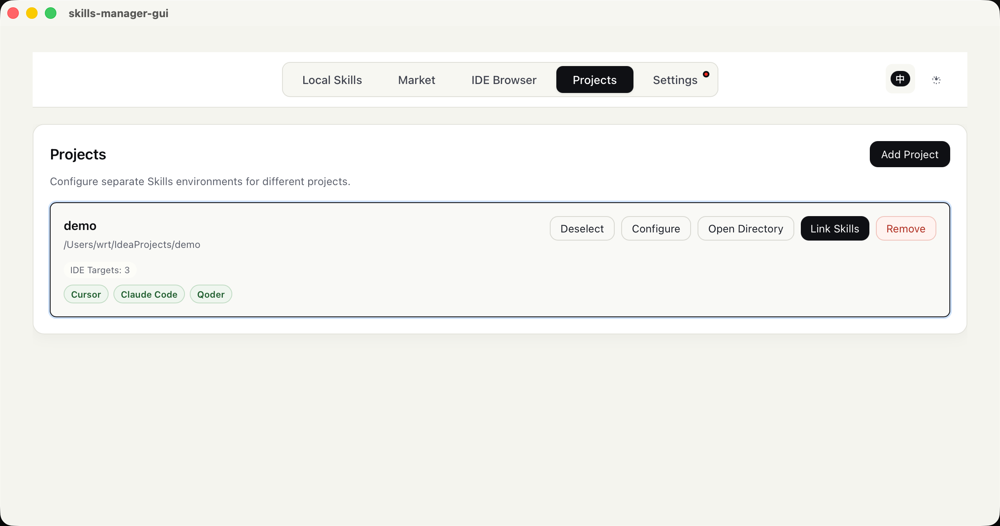

# Skills Manager

[English](README.md) | [中文](README_zh-CN.md)

**Quickly install skills to Global/Project**
A professional cross-platform AI Skills Manager. It empowers you to search for skills across major marketplaces (such as Claude Plugins, SkillsLLM, SkillsMP, etc.), download them into a unified local repository, and securely install them into any supported AI development environment instantly via symlinks. Fully compatible with Windows, macOS, and Linux out-of-the-box, infinitely expanding your AI programming assistants' capabilities.




## ✨ Core Features

- 🔍 **Aggregated Market Search**: Search quality skills from public registries in one place
- 📦 **Unified Local Repository**: Centralized management of downloaded skills (`~/.skills-manager/skills`)
- 🚀 **One-Click Installation**: Install unified local skills to target IDEs in seconds via symlinks
- 🛠️ **Multi-Dimensional Management**: Browse skills per IDE, uninstall cleanly and safely
- ⚙️ **Project Management**: Manage projects and mount skills to projects, configure IDEs for each project

## 🎯 Natively Supported IDEs (Alphabetical Order)

- **Antigravity**: `.gemini/antigravity/skills`
- **Claude Code**: `.claude/skills`
- **CodeBuddy**: `.codebuddy/skills`
- **Codex**: `.codex/skills`
- **Cursor**: `.cursor/skills`
- **Kiro**: `.kiro/skills`
- **OpenClaw**: `.openclaw/skills`
- **OpenCode**: `.config/opencode/skills`
- **Qoder**: `.qoder/skills`
- **Trae**: `.trae/skills`
- **VSCode**: `.github/skills`
- **Windsurf**: `.windsurf/skills`

## 📖 Usage Guide

### 📥 Installation & Usage

- **General Users (Recommended)**: Simply head to the [Releases page](https://github.com/Rito-w/skills-manager/releases) to download the latest executable installer.
- **Developers**: Clone the source code repository to run locally or customize in-depth.

### 🍎 macOS Security Note

Since Apple developer commercial signature is not configured yet, opening the app for the first time may trigger "App is damaged and can't be opened" or "from an unidentified developer" warnings. You can run the following terminal command to bypass it:

```bash
xattr -dr com.apple.quarantine "/Applications/skills-manager-gui.app"
```

### 🔍 1) Market

- Aggregated display of available skills from configured data sources.
- Clicking download automatically adds it to your local repository. If an older version exists, an "Update" button will be highlighted instead.

### 🗂️ 2) Local Skills

- Overview of all skills currently downloaded to your local repository.
- Click "Install" to select target IDEs for deployment via symlinks.

### ⌨️ 3) IDE Browser

- Switch workspace perspective (e.g., VSCode or Cursor) to view mounted skills for each IDE.
- Safe Uninstallation: Removes the symlink if linked, or deletes the physical directory if not a symlink.
- Can't find your IDE? Click "Add Custom IDE" in the top right to register its skills directory.

## 👨‍💻 Installation & Development

### Prerequisites

- Node.js (LTS recommended)
- Rust (installed via rustup)
- macOS: Xcode Command Line Tools

### Local Development

```bash
pnpm install
pnpm tauri dev
```

### Build & Release

```bash
pnpm tauri build
```

## 📡 Remote Data Sources

- **Claude Plugins**: `https://claude-plugins.dev/api/skills`
- **SkillsLLM**: `https://skillsllm.com/api/skills`
- **SkillsMP**: `https://skillsmp.com/api/v1/skills/search` (API key configuration may be required due to CORS restrictions)
- Source Code Download Proxy: `https://github-zip-api.val.run/zip?source=<repo>`

## 🛠 Tech Stack

- Desktop Runtime Framework: **Tauri 2**
- Frontend UI Layer: **Vue 3** + **TypeScript** + **Vite**
- System Operations Layer: **Rust** (Command side)

## 📄 License

TBD
